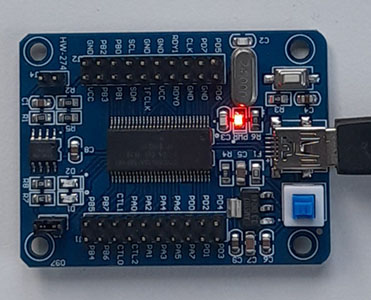

# FX2-Example

This code is a simple example of programming the FX2 device from Cypress

When the device first boots it toggles LEDs on PA0 and PA1 to show the code is running

Once booted any data sent from EP2 (OUT) is sent back to EP6 (IN) and issuing vendor command 0xB4 will toggle the LED attached to PA0.

Compiled and tested using SDCC v4.3

